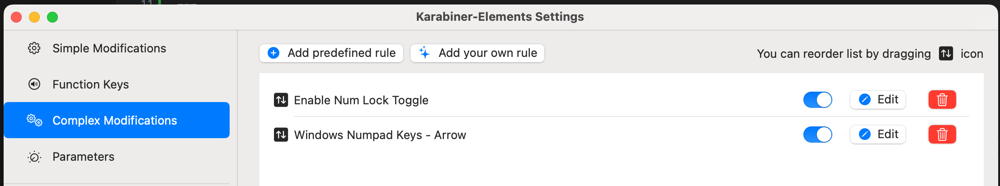

# karabiner-key

Mac의 karabiner에서 windows의 numlock를 사용하여 키패드를 방향키로 사용하는 맵핑 파일입니다.

0 -> insert

. -> delete

shift + 0 -> command + v

shift + . -> command + x

---

This is a mapping file that uses the keypad as an arrow key using Windows' numlock on Mac's Karabiner.

0 -> insert

. -> delete

shift + 0 -> command + v

shift + . -> command + x

